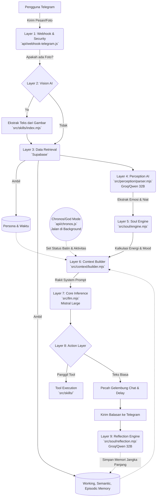

# Arsitektur & Alur Kerja Chatbot (Project Soul)

Dokumen ini memetakan secara detail alur kerja (workflow) pesan masuk hingga bot mengirimkan balasan, beserta komponen "Kesadaran Bawah Sadar" (Chronos). Sistem ini didesain sebagai **Agen Otonom (Agentic AI)** dengan 9 lapisan (layers) pemrosesan.

## Diagram Alur (Workflow Mapping)

---

## Detail 9 Lapisan (Layers) Pemrosesan

### 1. Webhook & Security Layer (Lapisan Keamanan & Antrian)
* **File Utama:** `api/webhook-telegram.js`
* **Fungsi:** Menangkap `update_id`, chat text, atau gambar dari Telegram. Sistem mengecek autentikasi (Secret Token) dan menggunakan Redis untuk *deduplication* (mengunci ID Pesan agar tidak terproses ganda jika terjadi delay dari Telegram).

### 2. Vision Pre-processing Layer (Lapisan Pemrosesan Visual - Opsional)
* **File Utama:** `src/skills/index.mjs` (Fungsi `analyzeImage`)
* **LLM Terkait:** AI Vision (Qwen-VL)
* **Fungsi:** Jika pesan mengandung foto, gambar di-fetch, diubah bentuknya, dan dikirim ke Vision AI untuk "dilihat". Hasil deskripsi gambar disisipkan ke dalam teks pesan.

### 3. Data Retrieval Layer (Lapisan Penggalian Memori & Profil)
* **Database Terkait:** Supabase & Redis
* **Fungsi:** Sistem mengumpulkan konteks:
  - Profil pengguna (zona waktu) dan Dinamika Hubungan.
  - Profil Persona bot.
  - *Working Memory* (Riwayat chat terakhir).
  - *Semantic Memory* (Fakta penting jangka panjang tentang pengguna).
  - *Episodic Memory* (Kejadian spesifik masa lalu yang ditarik via Vector/Semantic Search).

### 4. Perception Layer (Lapisan Persepsi Bawah Sadar)
* **File Utama:** `src/perception/parser.mjs`
* **LLM Terkait:** LLM Super Cepat (Groq Qwen-32B)
* **Fungsi:** Secara rahasia menganalisis pesan pengguna untuk mendeteksi *intent* (niat), *emotion* (emosi), dan *importance* (tingkat kepentingan). Mengembalikan output berwujud JSON mentah.

### 5. Soul Engine Layer (Lapisan Emosi & Energi Matematis)
* **File Utama:** `src/soul/engine.mjs`
* **Tipe:** Kalkulasi Logika Matematis (Non-LLM)
* **Fungsi:** Menghitung sisa "Energi" dan mengubah "Mood" bot berdasarkan hasil Persepsi (Lapisan 4). Misalnya, menghadapi pesan marah menguras lebih banyak energi bot.

### 6. Context Builder Layer (Lapisan Pembangun Realitas)
* **File Utama:** `src/context/builder.mjs`
* **Fungsi:** Merangkai semua data (Memori, Mood, Energi, Waktu Lokal, Hubungan) beserta data dari pikiran batin (Chronos) ke dalam satu **System Prompt** raksasa. Terdapat aturan ketat gaya bahasa gaul WhatsApp di sini.

### 7. Core Inference Layer (Lapisan Otak Utama)
* **File Utama:** `src/llm.mjs`
* **LLM Terkait:** LLM Utama (Mistral Large) dengan fallback Qwen.
* **Fungsi:** LLM merenungkan System Prompt + riwayat percakapan untuk menentukan balasan atau menentukan apakah bot butuh mengeksekusi "alat" (Tools).

### 8. Action & Execution Layer (Lapisan Aksi & Pengiriman)
* **File Utama:** `api/webhook-telegram.js` & `src/skills/`
* **Fungsi:** 
  - Jika mengeksekusi alat: Menjalankan fungsi spesifik (seperti generate foto).
  - Jika membalas teks: Memecah teks berdasarkan karakter pemisah `|`, dan mengirimkannya satu-satu ke Telegram dengan simulasi jeda mengetik (`typing...`).

### 9. Reflection Layer (Lapisan Perenungan & Tidur)
* **File Utama:** `src/soul/reflection.mjs`
* **LLM Terkait:** LLM Khusus (Groq Qwen-32B)
* **Fungsi:** Berjalan secara asinkron (*background*) setelah pesan terkirim. LLM mengekstrak fakta-fakta *baru* dari percakapan untuk disimpan ke database secara permanen, dan menghapus fakta yang kadaluarsa (Memory Pruning).

---

## Modul Latar Belakang: Chronos (God Mode)
* **File Utama:** `api/chronos.js`
* **Fungsi:** API yang dipanggil berkala (contoh: tiap 15 menit) untuk memberikan nyawa saat bot tidak dichat.
  - **Morning Routine:** Setiap jam 6 pagi, LLM membuat jadwal kegiatan dan *outfit* untuk bot.
  - **15-Min Pulse:** LLM memikirkan di mana bot berada detik ini, cuaca asli, aktivitasnya, dan apa isi *inner thought*-nya.
  - **Proactive Chat:** Jika nilai kangen tinggi (*Connection Drive*) dan user sedang sepi, bot akan menginisiasi chat duluan.
